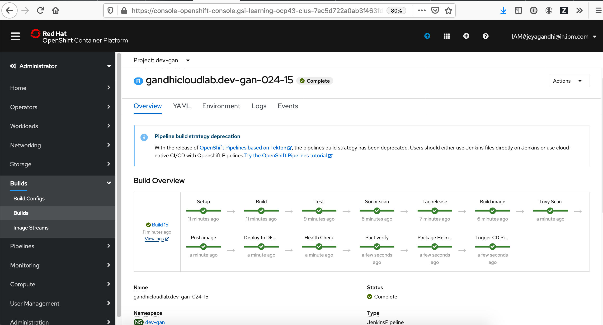
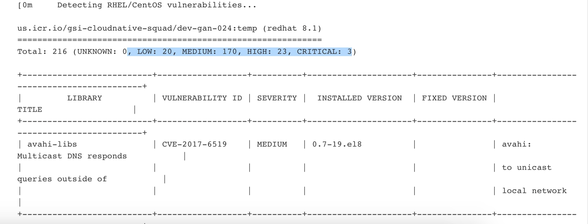
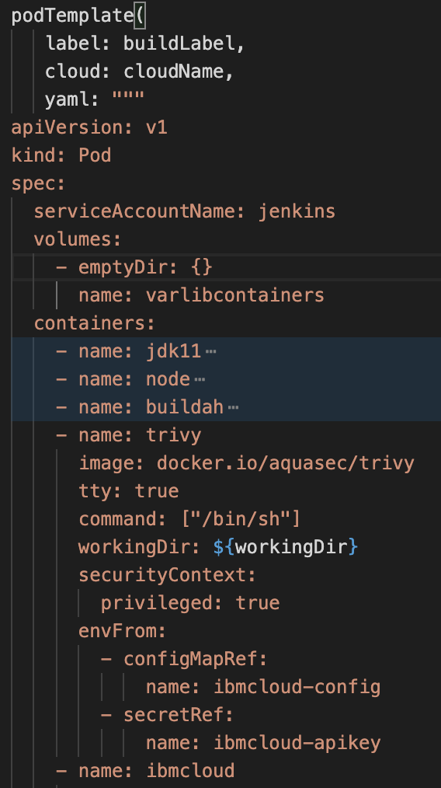
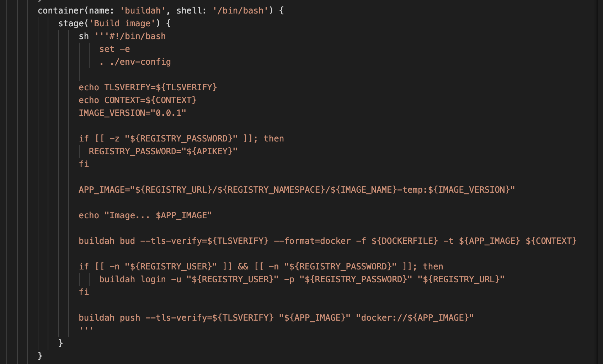
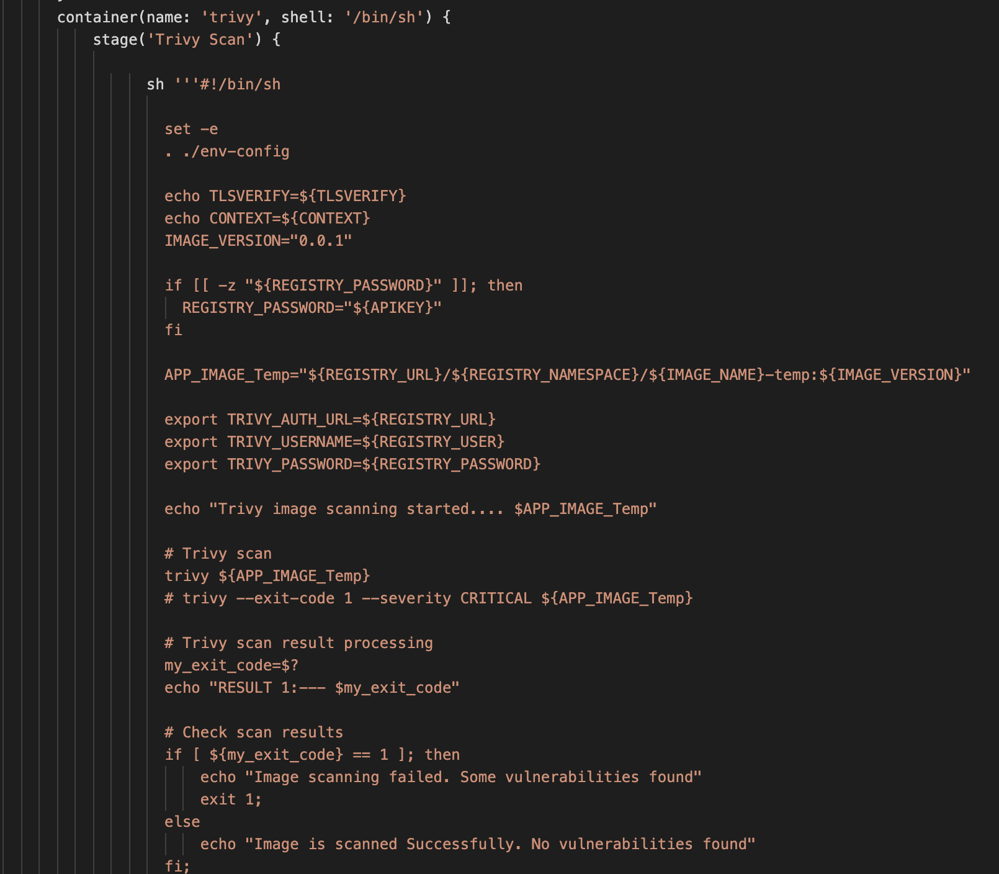
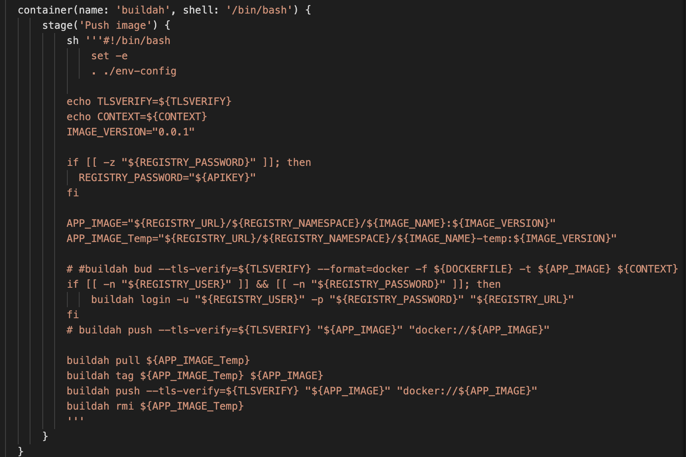
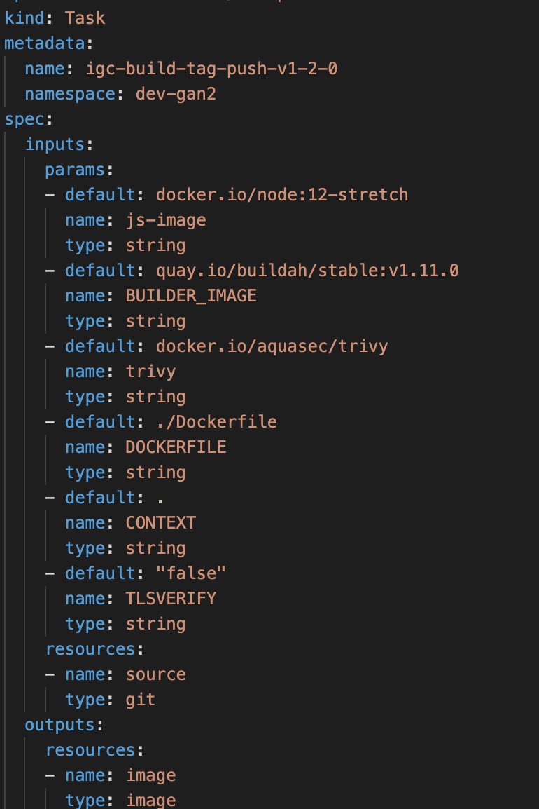
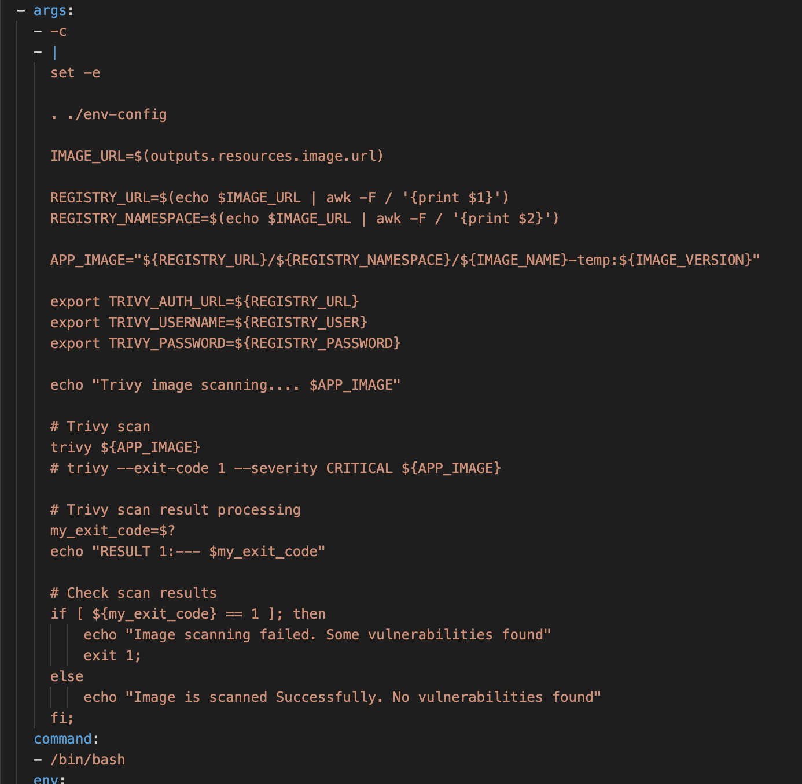
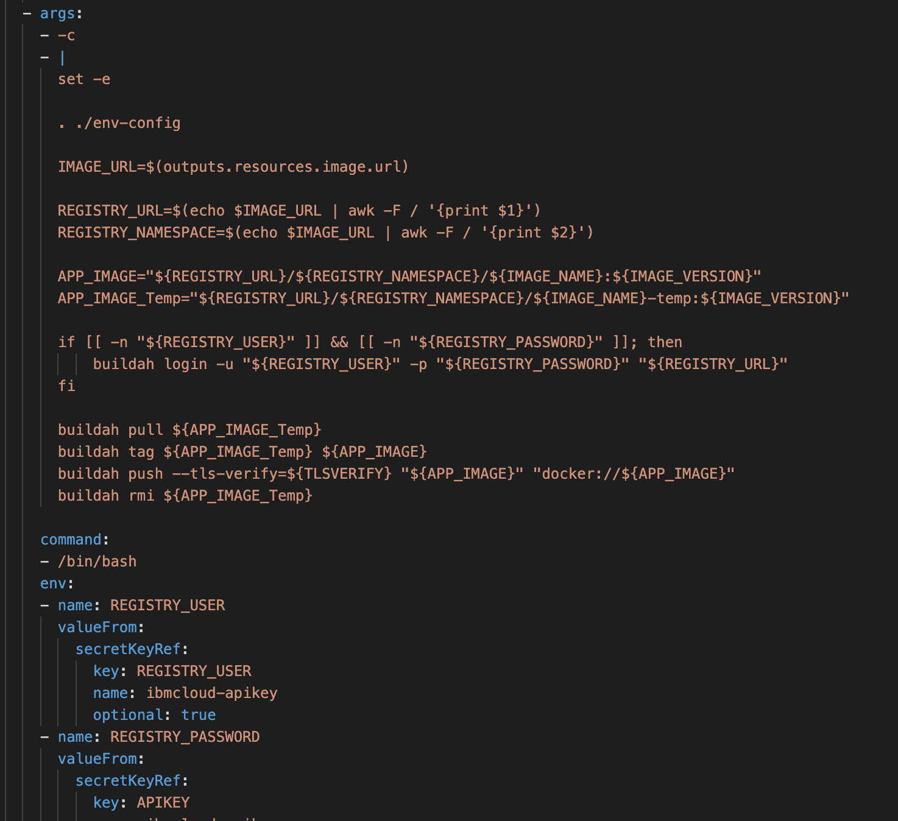

# DevSecOps Using Aquasec Trivy in Cloud Native Toolkit

As part of the DevSecOps, to ensure the security, the images undergo vulanarability scanning. There are several tools available for image scanning. 

`Trivy` is a Simple and Comprehensive Vulnerability Scanner for Containers, Suitable for CI.

The more information on Trivy is available in https://github.com/aquasecurity/trivy

In this article, we will see, how the trivy was integrated into the jenkins and tekton pipelines of Cloud Native Toolkit.


# Tags

DevSecOps, Aquasec, Trivy, jenkins, tekton, Cloud Native Toolkit


# 1. Integrating Trivy in jenkins

The CICD process contains several steps. There is a step called Build that will build a image and Push the image.

Lets split the step into 3 steps.

```
    Build Image
    Trivy Scan
    Push Image
```

Here is the modified pipeline.




#### Build Image

The build image will build the image.

#### Trivy Scan

Trivy scan will scan the image and print the Vulnerability count as Low, Medium, High and Critical.

Based on the configured exit criteria (0 Critical) the next step would in the pipeline will continue.

Here is the logs written during the pipeline execution.




#### Push Image

After the scan is completed, it Pushes the image to the Image Registry.


The pipeline script defined in the jenkinsfile. lets us see the changes done in the jenkins file.


# 2. Jenkinsfile Changes

### Declaration

Here is the declaration about the Trivy image in the `containers` section under `podtemplate`



### Build Image

Here is the step for Build Image.



A image is build using buildh. 

Then it is taged as a temp image.

Login to IBM Container Registry 

Push to the IBM Container Registry as a temporary basis.

### Trivy Scan

Here is the step for Scanning



Login details for IBM Container Registry

Triy scan

Verify results.

### Build Image

Here is the step for Build Image.



Login to IBM Container Registry 

Pull the temp image

Retag it to right name.

Push it to IBM Container Registry.

Remove the temporary image.


# 1. Integrating Trivy in Tekton

The CICD process contains several steps. There is a step called Build that will build a image and Push the image.

Lets split the step into 3 steps.

```
    Build Image
    Trivy Scan
    Push Image
```

Here is the modified pipeline.


The pipeline scripts are defined as Task in the yaml file. lets us see the changes done in the task file.


# 2. Tekton Task Changes

### Declaration

Here is the declaration about the Trivy image in the `containers` section under `podtemplate`



### Build Image

Here is the step for Build Image.


A image is build using buildh. 

Then it is taged as a temp image.

Login to IBM Container Registry 

Push to the IBM Container Registry as a temporary basis.

### Trivy Scan

Here is the step for Scanning



Login details for IBM Container Registry

Triy scan

Verify results.

### Build Image

Here is the step for Build Image.



Login to IBM Container Registry 

Pull the temp image

Retag it to right name.

Push it to IBM Container Registry.

Remove the temporary image.

