# Integrating DevSecOps Using Aquasec Trivy in Cloud Native Toolkit

As part of the DevSecOps, to ensure the security, the images undergo Vulnerability scanning. There are several tools available for image scanning. 

`Trivy` is a Simple and Comprehensive Vulnerability Scanner for Containers, Suitable for CI.

The more information on Trivy is available in https://github.com/aquasecurity/trivy

In this article, we will see, how the trivy was integrated into the `Jenkins` and `Tekton` pipelines of Cloud Native Toolkit.


# Tags

DevSecOps, Aquasec, Trivy, jenkins, tekton, Cloud Native Toolkit


# 1. Integrating Trivy in jenkins

The CICD process contains several steps. There is a step called `Build Image` that will build a image and Push the image to the image registry.

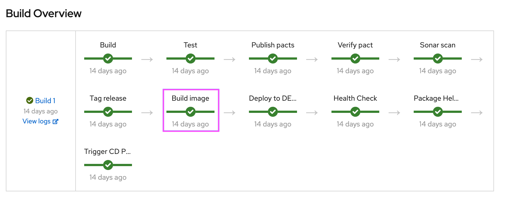


Need to split the step into 3 steps.

```
    Build Image
    Trivy Scan
    Push Image
```

Here is the modified pipeline.

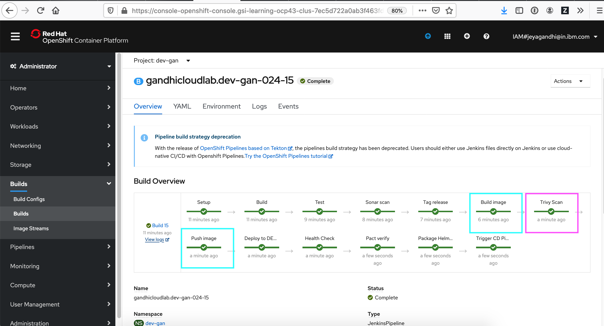


#### Build Image

The build image will build the image.

#### Trivy Scan

Trivy scan will scan the image and print the Vulnerability count as Low, Medium, High and Critical.

Based on the configured exit criteria (0 Critical) the next step would in the pipeline will continue.

Here is the logs written during the pipeline execution.

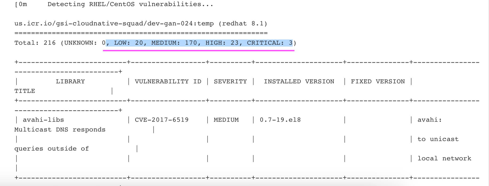


#### Push Image

After the scan is completed, it Pushes the image to the Image Registry.


The pipeline script defined in the jenkinsfile. lets us see the changes done in the jenkins file.


# 2. Jenkinsfile Changes

### Declaration

Here is the declaration about the Trivy image in the `containers` section under `podtemplate`

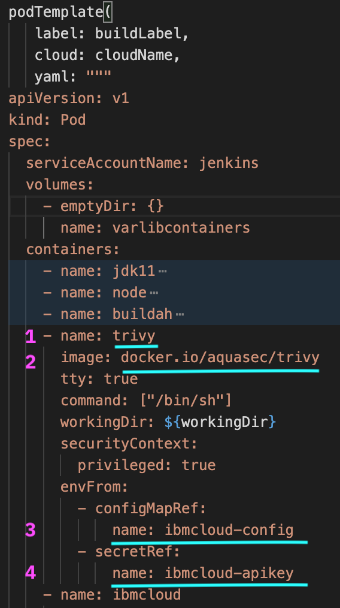

1. Name `trivy` will be used in the script to refer the trivy container.

2. The image tag of the `trivy`.

3. The `username` related configmap to connect to IBM Cloud Container registry.

4. The `password` related secrte to connect to IBM Cloud Container registry.

### Build Image

Here are the steps to Build Image.

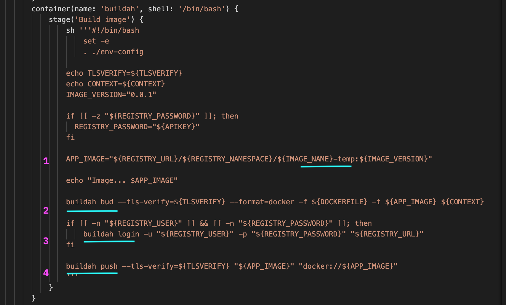

1. Temp image name is framed. 

2. Image is build using `buildah`. Here temp image name is used.

3. Login into IBM Cloud Container Registry using `buildah`.

4. Temp image is pushed to IBM Cloud Container Registry using `buildah`.


### Trivy Scan

Here are the steps for trivy Scanning

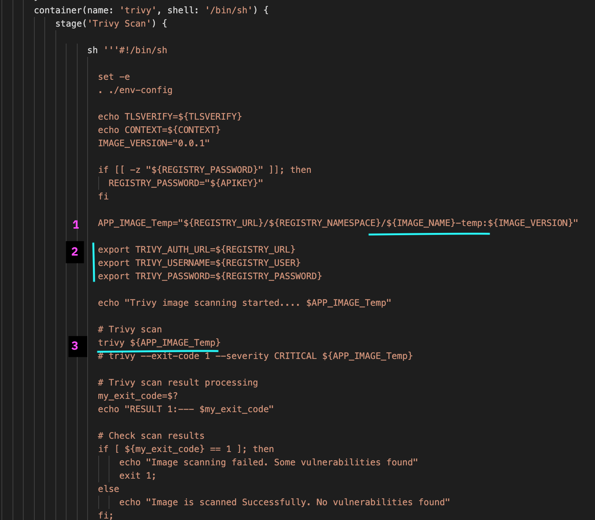

1. Refers the temp image name created in the previous step. 

2. Registry URL and user details to login into IBM Cloud Container Registry by trivy.

3. Trivy scanning the temp image found in the IBM Cloud Container Registry 

### Push Image

Here are the steps for Push Image.

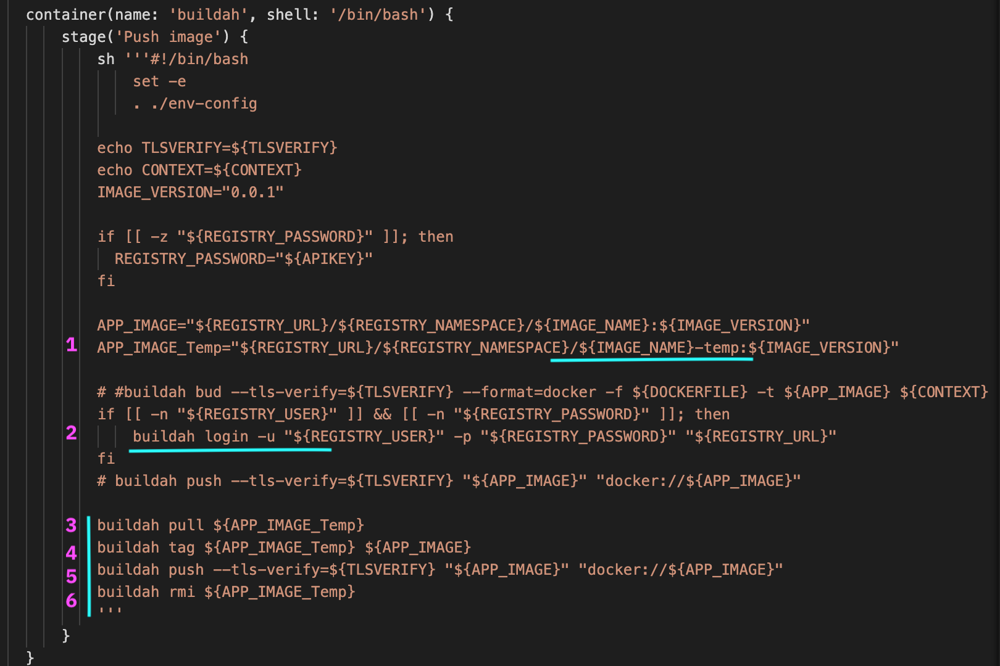

1. Refers the temp image name created in the previous step. 

2. Login into IBM Cloud Container Registry using `buildah`.

3. Pull the temp image using `buildah`.

4. Tag the image to the right image name.

5. Push the right image to IBM Cloud Container Registry using `buildah`.

6. Remove the temp image from IBM Cloud Container Registry using `buildah`.


# 2. Integrating Trivy in Tekton

The CICD process contains several steps. There is a step called `Build` that will build a image and Push the image to the image registry.

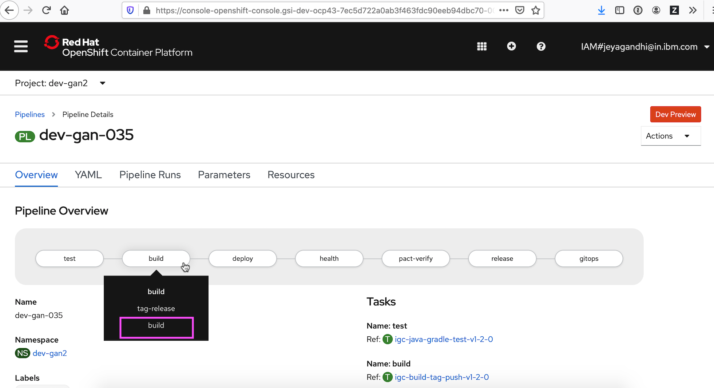


Need to split the step into 3 steps.

```
    build
    image-scan
    push
```

Here is the modified pipeline.

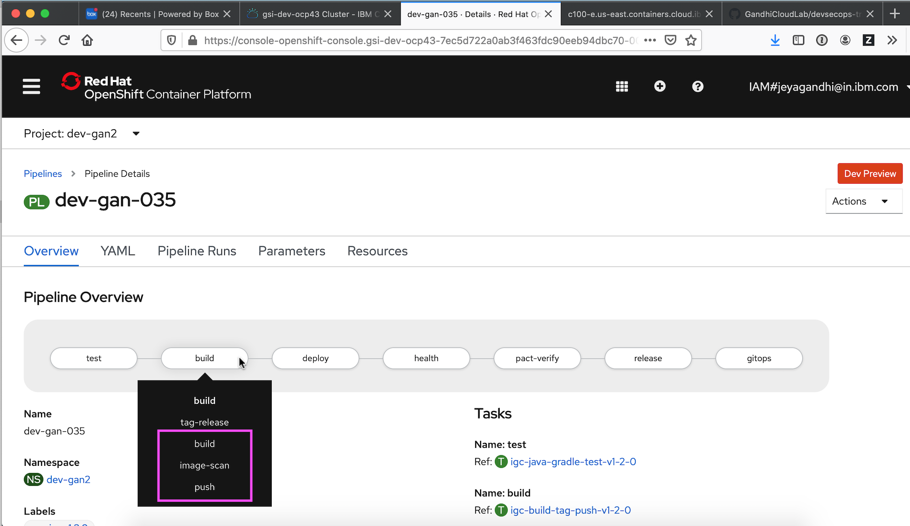


The pipeline scripts are defined as Task in the yaml file. lets us see the changes done in the task file.


# 2. Tekton Task Changes

### Declaration

Here is the declaration about the Trivy image in the `containers` section under `podtemplate`

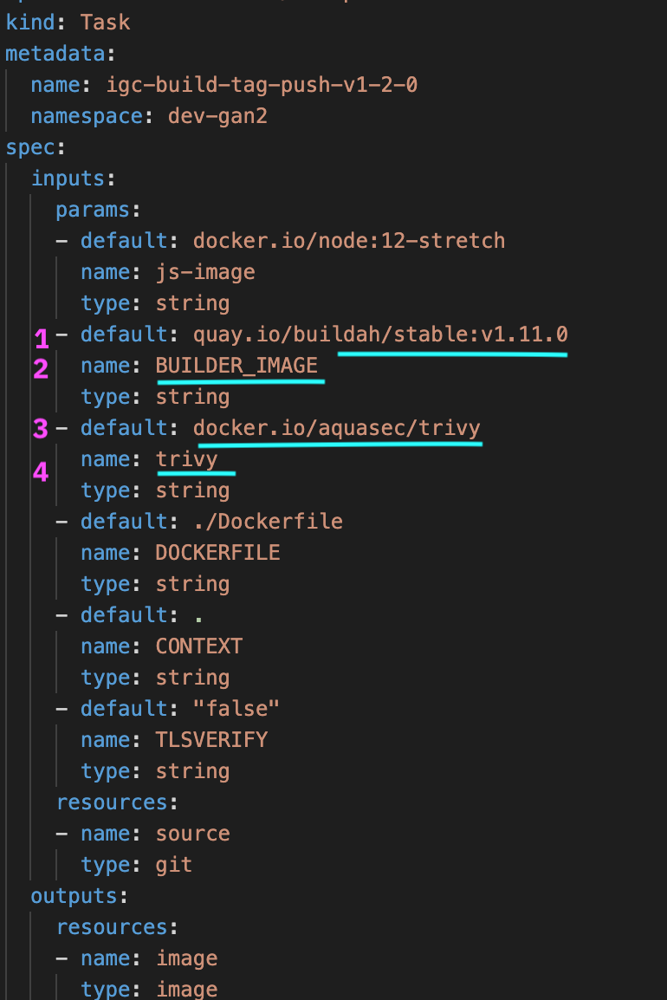

1. Image details of the of the `buildah`

2. The variable name of for the `buildah`

3. Image details of the of the `trivy`

4. The variable name of for the `trivy`

### Build Image

Here are the steps for Build Image.

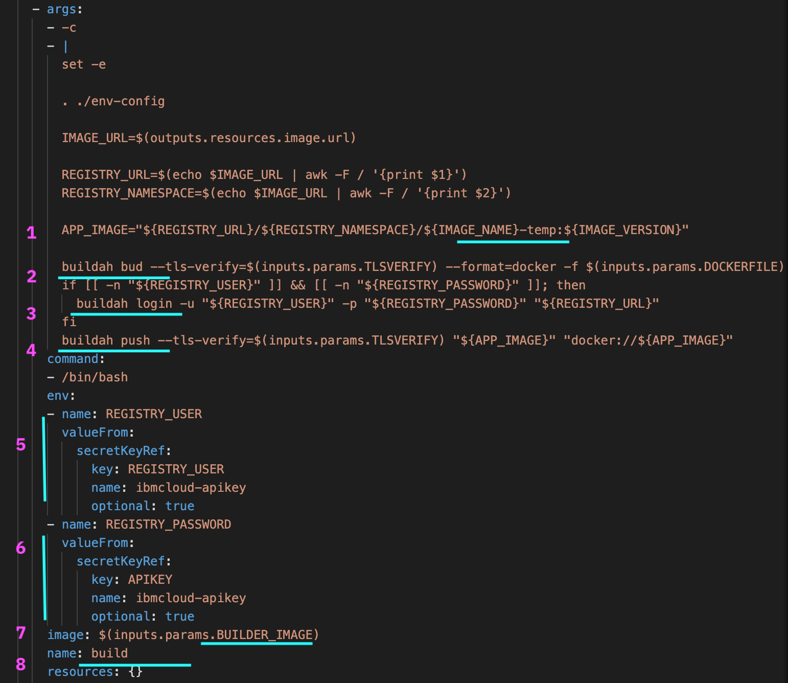

1. Temp image name is framed. 

2. Image is build using `buildah`. Here temp image name is used.

3. Login into IBM Cloud Container Registry using `buildah`.

4. Temp image is pushed to IBM Cloud Container Registry using `buildah`.

5. Username details to Login into IBM Cloud Container Registry.

6. Password details to Login into IBM Cloud Container Registry.

### Trivy Scan

Here are the steps for Scanning

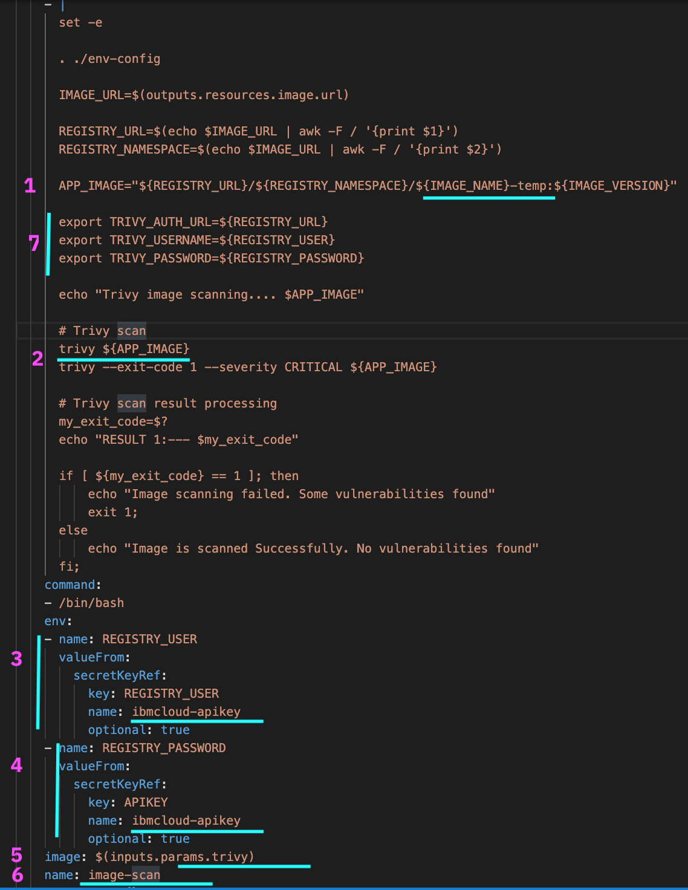

1. Refers the temp image name created in the previous step. 

2. Trivy scanning the temp image found in the IBM Cloud Container Registry 

3. Username details to Login into IBM Cloud Container Registry.

4. Password details to Login into IBM Cloud Container Registry.

5. Image details of the of the `trivy`

6. Name of the step

7. Registry URL and user details to login into IBM Cloud Container Registry by trivy.


### Push Image

Here are the steps for Pushing Image.

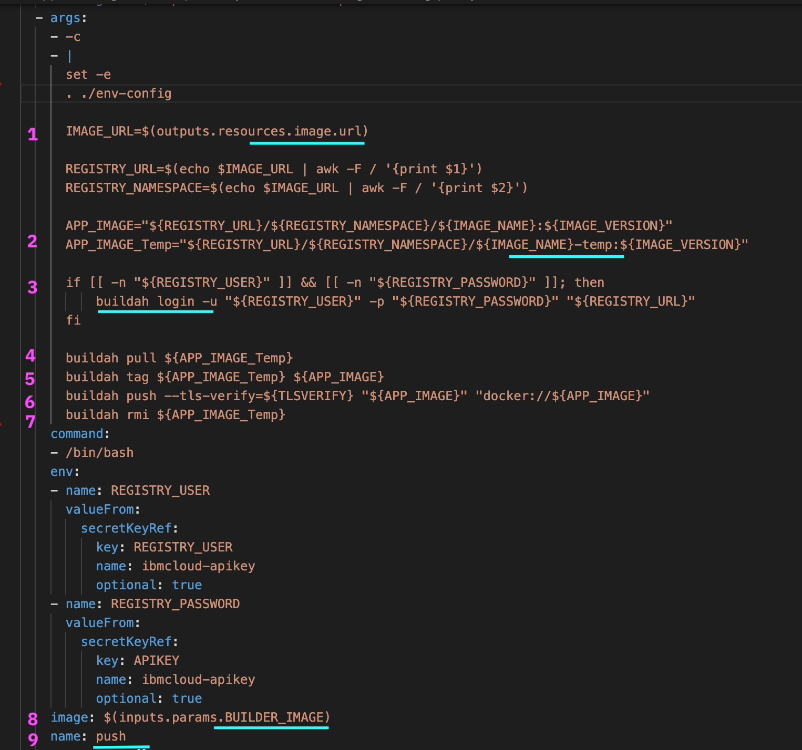

1. Refers the image url passed as a parameter. 

2. Refers the temp image name created in the previous step. 

3. Login into IBM Cloud Container Registry using `buildah`.

4. Pull the temp image using `buildah`.

5. Tag the image to the right image name.

6. Push the right image to IBM Cloud Container Registry using `buildah`.

7. Remove the temp image from IBM Cloud Container Registry using `buildah`.

8. Image details of the of the `buildah`

9. Name of the step